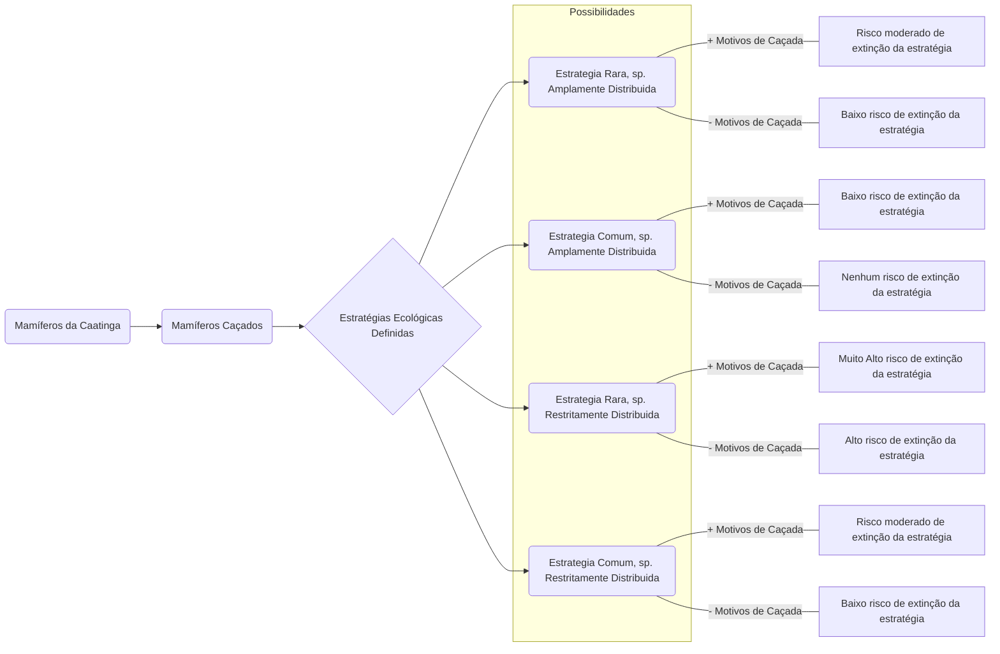

```{r setup, include=FALSE}
knitr::opts_chunk$set(echo = TRUE)
```

## 1. Objetivo

  Este projeto, tem como objetivo identificar as estratéfias ecológicas dos mamíferos
da Caatinga e investigar quais delas possuem mais representantes caçados.

### 1.1 Pergunta Norteadora
  A caça de mamíferos na Caatinga, apresenta um padrão direcional ou aleatório como pressão deletéria nas estratégias ecológicas e serviços ecossistêmicos?
  
### 1.2 Hipotese do trabalho
  Com o devido trabalho, testaremos hipóteses que avaliam se a caça atinge serviços ecossitêmicos de forma direcional ou difusa(aleatória). 
  Com isso, pode ser avaliado se os serviços ecossistêmicos podem possuir maiores chances de desaparecerem no bioma. 
  O risco do serviço ecossitemico desaparecer, depende da raridade da estratégia ecológica, da quantidade de espécies que possuem estratégias similares e se elas co-ocorrem, pois pode haver substituicao de espécies que promovem o mesmo serviço ecossitemico, e do tamanho da área de ocorrência.

#### Caça direcional
  A caça seria direcional, caso as espécies mais caçadas possuem estratégias ecológicas mais similares, resultando em uma maior pressão em serviços ecológicos específicos colocando-os em maior risco de desaparecerem.
  
#### Caça difusa
  A caça seria difusa ou aleatória, caso as espécies mais caçadas possuem estratégias ecológicas mais dissimilares, resultando em uma pressão de forma distribuída nos diferentes tipos de serviços ecológicos, diminuindo a probabilidade de desaparecimento de serviços específicos.

## 2. Materiais e Métodos

### 2.1 Dados
#### Mamíferos da Caatinga
   Para a montagem da lista de espécies de mamíferos da Caatinga, utilizamos o trabalho desenvolvido por Carmignotto, A. P. & Astúa, D. (2018). [Mammals of the Caatinga: Diversity, ecology, biogeography, and conservation](https://link.springer.com/chapter/10.1007/978-3-319-68339-3_8). Esse trabalho possui como registro 183 espécies, cujo os registros foram obtidos a partir de uma revisão crítica das listas desenvolvidas em pesquisas anteriores. 

#### Lista de Mamíferos Caçados na Caatinga
  Para determinar quais espécies de mamíferos são caçadas na Caatinga, utilizamos a revisão de Nóbrega Alves R. R. et. al., (2016), [Game mammals of the Caatinga biome. Ethnobiology and Conservation](http://ethnobioconservation.com/index.php/ebc/article/download/90/79), do qual faz uma revisão do conhecimento etnobiológico acumulado, sobre a caça de mamoíferos da Caatinga.

#### Estratégias Ecológicas (EE)
  Para identificar as EE dos mamíferos da Caatinga, utilizamos o trabalho desenvolvido por Cook S.C., Eigenbrod F. & Bates A.E. (2019), publicado na Nature Communications, entitulado 
[Projected losses of global mammals and birds ecological
strategies](https://www.nature.com/articles/s41467-019-10284-z).
  Esse trabalho, compilou e analisou traços ecológicos de mamíferos e aves do mundo (15.484 espécies terrestres). As informações utilizadas como traços ecológicos foram: i) proporção de tipos alimentar; ii) proporção do uso do hábtat de forrageio; iii) massa corpórea'; iv) tamanho da ninhada; v) duração da geração. O tratamento e análise dos dados podem ser melhor vistos [aqui](https://www.nature.com/articles/s41467-019-10284-z), e trabalharemos com seus resultados.

```{r pacote, echo = FALSE, include = FALSE, eval = TRUE}
install.packages(DiagrammeR)
library(DiagrammeR)
```

#### Fluxo da Investigação


## 3. Dados
  A lista de espécies de mamíferos da Caatinga [(Carmignotto, A. P. & Astúa, D., 2018)](https://link.springer.com/chapter/10.1007/978-3-319-68339-3_8), foi compilada e organizada em planilha do excel, da qual encontra-se disponível [AQUI](https://docs.google.com/spreadsheets/d/17r2wn1nD07B7LY8vvGQe_t0pxUcPSUO1Q0JnNlEZ-xQ/edit?usp=sharing).
  Já a lista de espécies de mamíferos caçados [(Nóbrega Alves R. R. et. al., 2016)](http://ethnobioconservation.com/index.php/ebc/article/download/90/79), foi compilada e organizada em planilha do excel, encontra-se disponível [AQUI](https://docs.google.com/spreadsheets/d/1c3ATQ6x2KjyMuskkBMVJccAxi7KhJ71Uay_HqaW7eWs/edit?usp=sharing).
  Os traços ecológicas [(Cook S.C., Eigenbrod F. & Bates A.E., 2019)](https://www.nature.com/articles/s41467-019-10284-z), estão disponnibilizados [AQUI](https://github.com/03rcooke/hyper_pca/blob/master/data/trait.csv)


